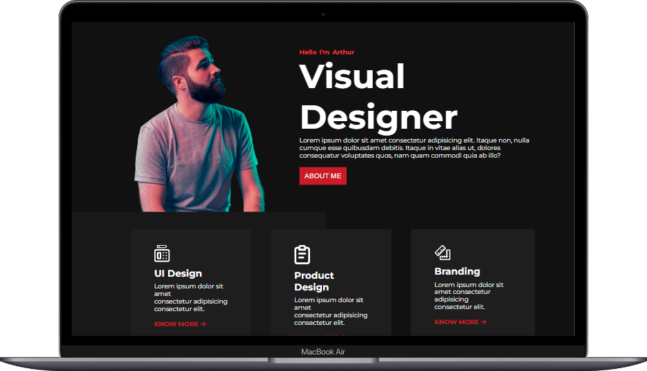

# Product Design Landing Page

***
## Description

This project [Product Design Landing Page]() was built using Semantic HTML and CSS from scratch. The main aim was to make the webpage based on the design provided and also make it responsive for all major devices. This project helped me in learning and brushing up concepts like **grid**, **positions(absolute, relative)**, **flexbox**, **pseudo classes** and to make the webapge look production ready with help of HTML & CSS only. The Project was completed under guidance of [Hitesh Choudhary](https://github.com/hiteshchoudhary), CTO Ineuron

***

### Links for Project

* [LIVE Project Link]()

* [Youtube Video Demo]()

* [Source Code]()

***
### Built With 

* Semantic HTML
* Custom CSS classes
* FlexBox
* Grid
* Positions
* Media Queries
* Pseudo elements & classes

***

### Key Learnings

* Learned to create checkbox used for slider menu on smaller screens
* Learned to create background box webpage that looks cool
* Learned using [grid](https://developer.mozilla.org/en-US/docs/Web/CSS/CSS_Grid_Layout)
* Learned using Grid for responsive designs as well as to create stats counter.
* Learned indepth of [flexbox](https://developer.mozilla.org/en-US/docs/Web/CSS/flex) and it's properties
* Learned to handle various cards inside the section.
* Learned indepth of positions and elements positioning
* Learned to make webpage responsive with the help of [media queries](https://developer.mozilla.org/en-US/docs/Web/CSS/Media_Queries/Using_media_queries)

***

### Time Taken to finish this project
 

>4 hours to build it from scratch.

>3 hours to make it responsive

 

***

### Screencaptures of Project

 

  1. #### Whole Webpage

   

  

   

  2. #### Mobile View

 

.gif) 

 

  3. #### Tablet View 

   

  .png)

   

   

  4. #### Large Screen View 

   

  

   
  
  

   

***

### Checkout Portfolio & Other Projects
 

#### [Personal Portfolio]()

#### [Findcoder Profile]()
***

### Connect with Me
* [Mailto](mailto:shubhambhoj3@gmail.com)
* [LinkedIn]()
* [Github]()
* [Findcoder]()
***
***
[go to top](#product-design-landing-page)